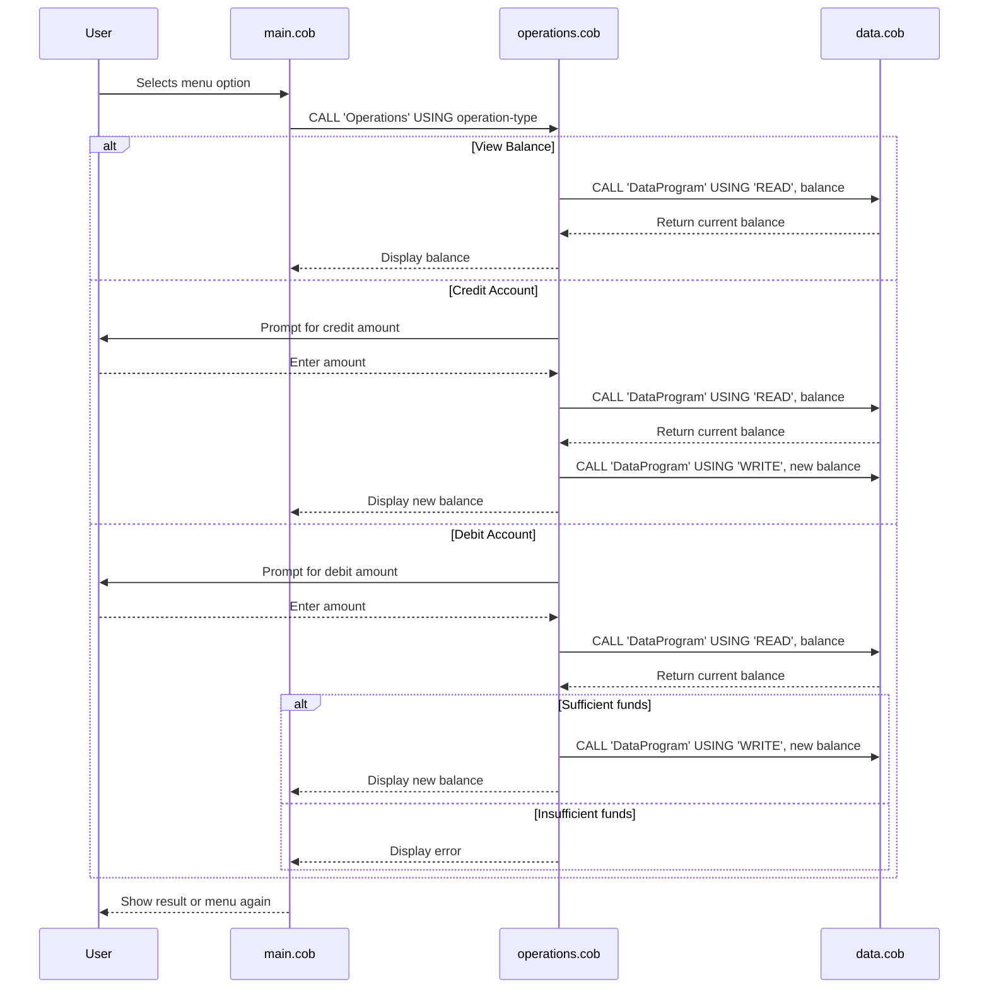

# COBOL Student Account Management System

This project is a simple COBOL-based system for managing student accounts, including viewing balances, crediting, and debiting accounts. The system is organized into three main COBOL files, each with a specific responsibility.

## File Overview

### 1. `main.cob`
**Purpose:**
- Acts as the entry point and user interface for the account management system.
- Presents a menu to the user with options to view balance, credit, debit, or exit.
- Handles user input and delegates operations to the `operations.cob` module.

**Key Functions:**
- Displays the main menu and processes user choices.
- Calls the Operations program with the selected action.

**Business Rules:**
- Only allows valid choices (1-4). Invalid choices prompt the user again.
- Exits cleanly when the user selects the exit option.

---

### 2. `operations.cob`
**Purpose:**
- Implements the core business logic for account operations.
- Handles credit, debit, and balance inquiry actions.

**Key Functions:**
- Receives the operation type from `main.cob`.
- For 'TOTAL', reads and displays the current balance.
- For 'CREDIT', prompts for an amount, adds it to the balance, and updates storage.
- For 'DEBIT', prompts for an amount, checks for sufficient funds, subtracts if possible, and updates storage.

**Business Rules:**
- Debits are only allowed if sufficient funds are available; otherwise, an error message is shown.
- All balance updates are persisted via the data program.

---

### 3. `data.cob`
**Purpose:**
- Manages persistent storage of the account balance.
- Provides read and write operations for the balance.

**Key Functions:**
- For 'READ', returns the current stored balance.
- For 'WRITE', updates the stored balance with the new value.

**Business Rules:**
- The balance is initialized to 1000.00 by default.
- Only two operations are supported: 'READ' and 'WRITE'.

---

## Business Rules Summary
- The system starts with a default balance of 1000.00.
- Credits add to the balance; debits subtract if funds are sufficient.
- All operations are menu-driven and require user confirmation.
- Data integrity is maintained by always reading and writing through the data module.

---

## Directory Structure
```
src/
  cobol/
    main.cob         # Main menu and user interface
    operations.cob   # Business logic for account operations
    data.cob         # Persistent storage for balance
```

---

For more details, see the comments in each COBOL source file.

---

## Sequence Diagram: Data Flow


